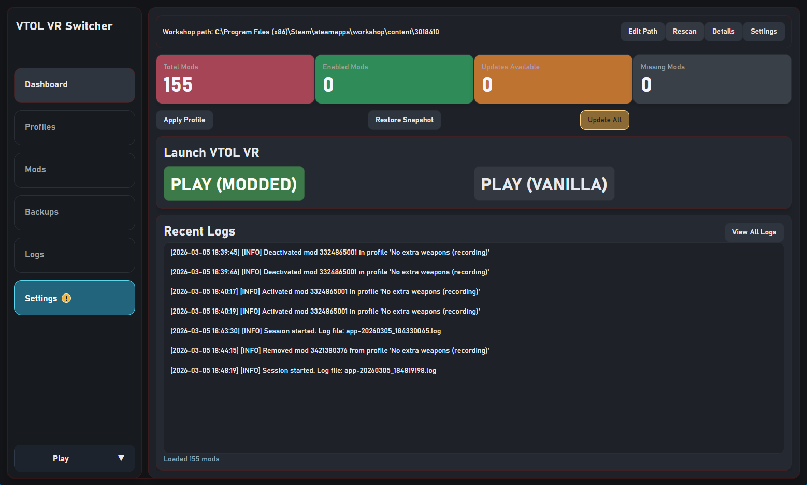

# VTOL VR Workshop Profile Switcher

[](https://discord.gg/vf9dfUv6FK)

Switch VTOL VR Steam Workshop mod setups in seconds using reusable profiles.

If this project is useful, please consider giving it a star on GitHub or joining the [Discord community](https://discord.gg/vf9dfUv6FK).

## TL;DR

`VTOL VR Workshop Profile Switcher` scans the local VTOL VR Mod Loader Workshop folder, saves named mod profiles, and applies them while keeping workshop folders in canonical `<WorkshopId>` naming. It also supports live refresh, logs, and snapshot backups before changes.

## Requirements

This tool is only a profile switcher for locally installed mods. It does not include the VTOL VR Mod Loader itself.

- Own VTOL VR on Steam.
- Install [VTOL VR Mod Loader](https://store.steampowered.com/app/3018410/VTOL_VR_Mod_Loader/) from Steam first.
- Subscribe to or download required mods through the VTOL VR Mod Loader / Steam Workshop before using this app.
- This tool does not install, update, or download mods.
- This app is a helper/profile manager for local Mod Loader Workshop content.
- It does not replace, bundle, or modify the VTOL VR Mod Loader.

## Screenshots




## Feature Overview

| Feature | Included |
| --- | --- |
| Auto-detect VTOL VR Workshop path from Steam libraries | &#10003; |
| Manual Workshop path override | &#10003; |
| Detect enabled/disabled mods from folder naming | &#10003; |
| Save and load named profiles | &#10003; |
| One-click apply profile (folder rename engine) | &#10003; |
| Snapshot backup before apply | &#10003; |
| Restore latest snapshot | &#10003; |
| Live folder refresh / watcher | &#10003; |
| Search/filter and bulk toggle mods | &#10003; |
| Logging (operations and crash logs) | &#10003; |
| Built-in Steam Workshop page opening after delete | &#10003; |
| Profile package import/export (JSON) | &#10003; |
| Missing mod assistant (manual workshop opening) | &#10003; |
| CLI mode | &#10007; |
| Drag-and-drop mod package import | &#10007; |

For the full categorized feature list, see [FEATURES.md](docs/FEATURES.md).

## How to Use

1. Scan and review mods.
Open the app, confirm the Workshop folder path (`steamapps/workshop/content/3018410`), and scan installed mods.

2. Create a profile.
Enable/disable mods in the UI, then save that selection as a named profile (for example, `PvE Coop` or `Vanilla+`).

3. Apply when needed.
Select a saved profile and click apply. The app renames folders to match the selected profile and creates a snapshot backup first.

4. Share profiles with package import/export.
Use `EXPORT SELECTED` or `EXPORT ALL` to create a portable JSON profile package. Use `IMPORT PACKAGE` to import packages from other users, with conflict handling (`Rename`, `Overwrite`, or `Skip`).

5. Resolve missing mods manually (no SteamCMD).
If a profile references workshop IDs that are not installed locally, the Missing Mods panel appears. Use:
- `OPEN NEXT MISSING MOD` to open each required Workshop page (`steam://` first, then browser fallback).
- `COPY ALL MISSING IDS` to copy all IDs.
- `RESCAN` after subscribing/downloading.
- `APPLY AGAIN` once missing mods are installed.
The app logs opened IDs, import/apply outcomes, and remaining missing IDs after rescans.

## Profile Package Format

Exported packages use JSON schema version `1`:

```json
{
  "schemaVersion": 1,
  "packageName": "All Profiles",
  "createdAtUtc": "2026-02-16T10:15:30.0000000Z",
  "profiles": [
    {
      "name": "PvE Coop",
      "notes": "Carrier ops setup",
      "iconKind": "ShieldAirplane",
      "enabledWorkshopIds": ["1234567890", "9876543210"]
    }
  ]
}
```

Notes:
- `enabledWorkshopIds` are numeric Steam Workshop IDs (non-numeric values are dropped on import).
- `iconKind` stores the selected profile icon name. Unknown icon names fall back to the default squadron icon.
- Duplicate workshop IDs in a profile are removed automatically.
- Name conflicts during import follow the selected policy.

## Installation

### Option 1: Use a Release Build (Recommended)

1. Open the repo's [Releases](https://github.com/B1progame/Vtol-Vr-Mod-Profiler/releases) page.
2. Download the latest installer or packaged build for Windows.
3. Install and launch `VTOLVRWorkshopProfileSwitcher`.

#### Windows Trust and SmartScreen Prompts

Windows may show a trust permission prompt during installation. This is expected because the installer needs permission to install the app on the local PC.

Windows SmartScreen may also appear because this is a small unsigned project, or because a new release has not built up enough reputation with Microsoft yet. Only run installers downloaded from this repository's official [Releases](https://github.com/B1progame/Vtol-Vr-Mod-Profiler/releases) page. If SmartScreen appears, choose `More info`, then `Run anyway`.

### Option 2: Build from Source (.NET 8)

Requirements:

- Windows
- .NET 8 SDK
- Steam with VTOL VR Workshop content installed

```powershell
dotnet restore .\VTOLVRWorkshopProfileSwitcher.sln
dotnet build .\VTOLVRWorkshopProfileSwitcher.sln -c Release
dotnet run --project .\src\VTOLVRWorkshopProfileSwitcher\VTOLVRWorkshopProfileSwitcher.csproj
```

Optional installer build (requires Inno Setup 6 and uses the current project version by default):

```powershell
.\scripts\build-installer.ps1 -Configuration Release -Runtime win-x64
```

## Project Status and Legal Notes

- This is an unofficial fan-made utility for managing locally installed VTOL VR Mod Loader Workshop setups.
- It is not affiliated with, endorsed by, or sponsored by Boundless Dynamics, LLC or Valve.
- The app does not ship, download, decrypt, unlock, or redistribute VTOL VR, the VTOL VR Mod Loader, Workshop mods, or paid game content.
- Users are responsible for following the terms for VTOL VR, VTOL VR Mod Loader, Steam, Steam Workshop, and any mods they install.
- `VTOL VR` and `Boundless Dynamics` are trademarks of Boundless Dynamics, LLC.

## Safe Usage, Backups, and Warnings

- Close VTOL VR before applying profile changes.
- The app changes mod state by renaming Workshop folders.
- A snapshot backup is created before profile apply.
- Keep Steam Workshop content fully synced before switching profiles.
- If anything looks wrong, use restore snapshot before making more changes.

Data locations:

- `%LOCALAPPDATA%\VTOLVR-WorkshopProfiles\profiles` - saved profiles
- `%LOCALAPPDATA%\VTOLVR-WorkshopProfiles\backups` - apply snapshots
- `%LOCALAPPDATA%\VTOLVR-WorkshopProfiles\logs\app.log` - app logs
- `%USERPROFILE%\Documents\VTOLVR-WorkshopProfiles\logs\crash.log` - crash logs
- `%LOCALAPPDATA%\VTOLVRWorkshopProfileSwitcher\thumbnail-cache` - image cache

## Troubleshooting / FAQ

### The app cannot find the Workshop folder

Use manual path override and point to:
`<SteamLibrary>\steamapps\workshop\content\3018410`

### Mods did not switch as expected

Close VTOL VR and Steam, reopen the app, rescan, then apply again. If needed, restore the latest snapshot backup.

### Imported/applied profile shows missing mods

Use the Missing Mods panel to open required workshop pages one by one, wait for Steam to download them, then click `RESCAN` and `APPLY AGAIN`.

### A mod is missing metadata or thumbnail

This can happen when Steam metadata is unavailable. The mod can still be managed by Workshop ID.

### Reverting after applying a profile

Use the restore snapshot action to revert to the last pre-apply state.

### Where are logs?

See the paths in the Safe Usage section above.

## Community Requests / Questions

Feedback and ideas are welcome:

- What features should we add next?
- What integrations would help common workflows most?
- What workflow improvements would make profile switching faster?
- What UX changes would make the app easier to use?
- Mockups or concept ideas that should be explored.

Please open a GitHub issue or join the Discord for feature suggestions, workflow ideas, UX suggestions, support, beta releases, and concept/mockup proposals.

Useful links:

- Discord: <https://discord.gg/vf9dfUv6FK>
- Issues: <https://github.com/B1progame/Vtol-Vr-Mod-Profiler/issues>
- Releases: <https://github.com/B1progame/Vtol-Vr-Mod-Profiler/releases>


## Contributing

Issues and pull requests are welcome. Small fixes, UX improvements, bug reports, and feature requests all help.
